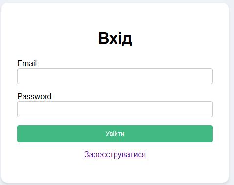
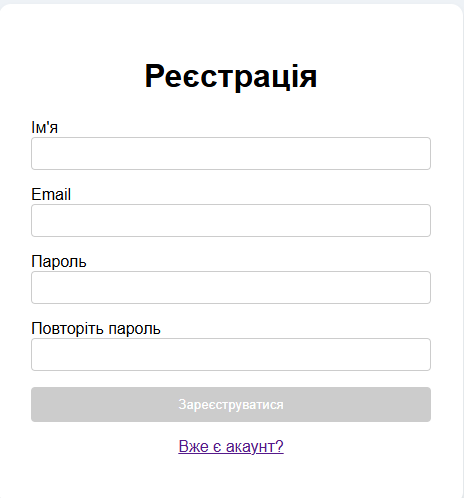
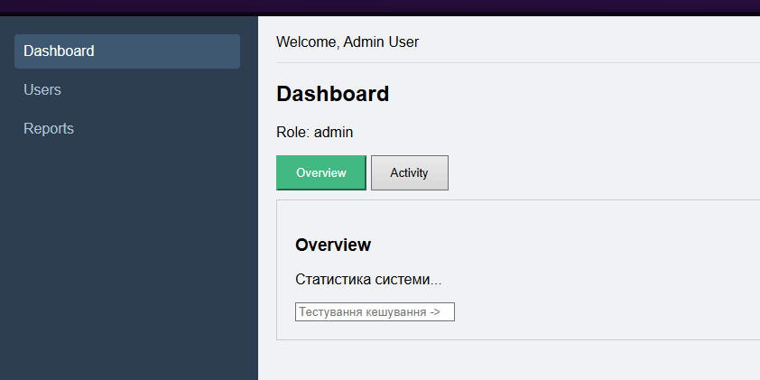
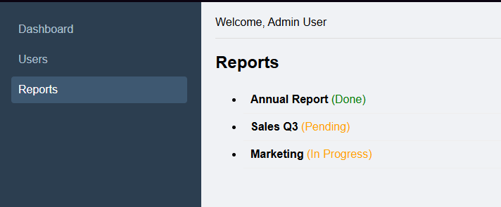

# Лабораторна робота №2: Взаємодія компонентів та роутинг у Vue.js

## Опис
Створення міні-адмін панелі з використанням Vue 3 (Composition API) та Vue Router. Реалізовано механізми авторизації, захисту маршрутів, lazy-loading та різні способи взаємодії між компонентами.

## Запуск проекту

1. Встановлення залежностей:
   ```bash
   npm install

   ---
2. Запуск локального сервера:
   ```bash
   npm run dev
   
   ---

## Скріншоти

1. Сторінка авторизації (Login) 
2. Сторінка реєстрації з валідацією 
3. Адмін-панель (Dashboard) 
4. Звіти (Scoped Slots) 

## Технічні деталі (Реалізація вимог)

1. Компоненти та v-model
BaseInput.vue: Реалізовано кастомний інпут з використанням макросу defineModel (Vue 3.4+) для двостороннього зв'язування даних. Це дозволяє використовувати v-model у батьківських компонентах без зайвого коду.


2. Слоти (Slots)

* Default Slot: Використано в AuthLayout.vue для обгортання контенту форм входу та реєстрації.
* Named Slot: Використано в AdminLayout.vue (слот sidebar) для можливості кастомізації меню навігації.
* Scoped Slot: Реалізовано в ReportsView.vue (слот #row="{ item }"). Це дозволяє батьківському компоненту отримувати дані про рядок таблиці та самостійно вирішувати, як їх стилізувати (наприклад, колір статусу).

3. Provide / Inject

* Provide: У AdminLayout.vue передається реактивний об'єкт userData (імітація даних авторизованого користувача).
* Inject: У DashboardView.vue ці дані приймаються через inject для відображення ролі користувача, оминаючи передачу через props.

4. KeepAlive

* Використано на сторінці Dashboard для кешування вкладок.
* Компонент DashboardOverview загорнуто в <KeepAlive>, що дозволяє зберігати введені дані в інпутах при перемиканні між вкладками (Overview/Activity).

5. Vue Router

* Lazy Loading: Маршрути адмін-панелі (/admin/...) завантажуються ліниво (import(...)) для оптимізації.
* Navigation Guards: Реалізовано глобальний guard beforeEach, який перевіряє мета-поле requiresAuth та наявність "токена" в localStorage. Неавторизованих користувачів перенаправляє на логін.
* Scroll Behavior: Налаштовано скидання скролу вгору (top: 0) при переході на нову сторінку.
