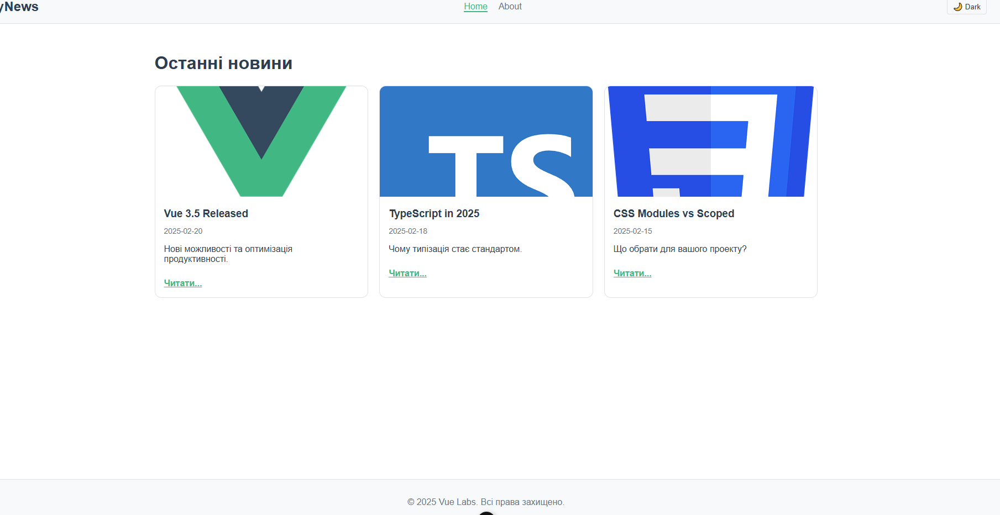
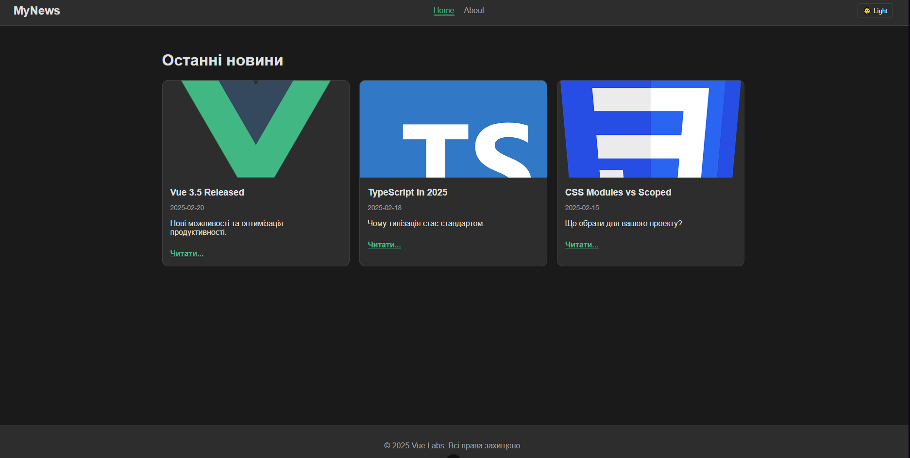
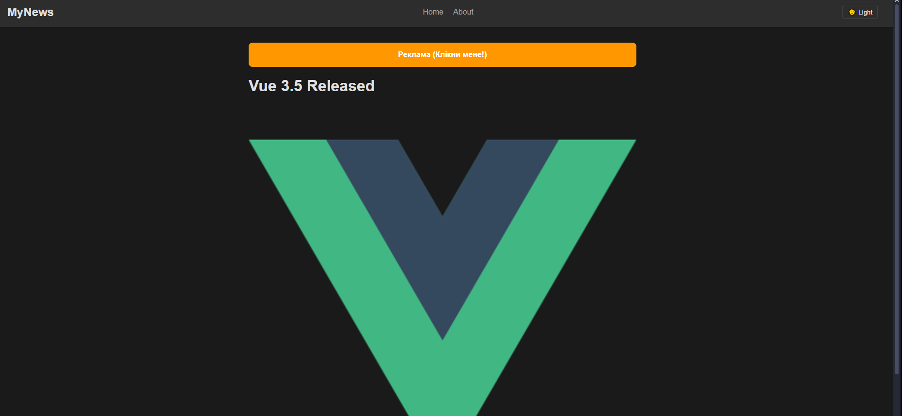
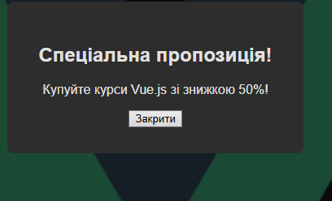

# Лабораторна робота №3: Стилізація компонентів у Vue.js

## Опис проекту

Розробка міні-сайту новин із використанням розширених можливостей Vue 3. У проекті реалізовано перемикання тем (світла/темна), анімації переходів між сторінками, модальні вікна через Teleport та різні підходи до стилізації (Scoped styles, CSS Modules, v-bind).

## Інструкція із запуску

1. **Встановлення залежностей:**
   ```bash
   npm install
   ```

---

2. **Запуск локального сервера:**
   ```bash
   npm run dev
   ```

---

## Скріншоти

1. Головна сторінка (Світла тема) 
2. Темна тема 
3. Сторінка новини з динамічним стилем (v-bind) 
4. Модальне вікно (Teleport + Transition) 

## Технічні деталі

1. **Стилізація та CSS**

- Scoped Styles: Використано в більшості компонентів (TheHeader, HomeView) для ізоляції стилів.
- CSS Modules: Реалізовано в компоненті NewsCard.vue (файл NewsCard.module.css). Це забезпечує повну ізоляцію класів і дозволяє звертатися до них як до об'єкта $style або імпортованого об'єкта.
- v-bind() у CSS: Використано на сторінці ArticleView.vue. Колір рекламного банера динамічно змінюється через змінну JavaScript (const bannerColor), яка прив'язана до CSS властивості background-color.
  Теми (Dark/Light): Реалізовано через CSS Variables (:root vs .dark-theme) у файлі main.css. Стан теми зберігається в localStorage.

2. **Анімації та UX**

- Page Transitions: Компонент <RouterView> обгорнуто в <Transition name="fade">. Використано режим mode="out-in" для плавного переходу між маршрутами.
- Modal Animation: Модальне вікно має анімацію появи (opacity), реалізовану через класи .modal-enter-active та .modal-leave-active.

3. **Teleport**

- Компонент AdModal.vue використовує <Teleport to="body">. Це дозволяє рендерити модальне вікно за межами ієрархії компонентів (безпосередньо в <body>), що спрощує позиціонування (position: fixed) та перекриття контенту.

## Висновок: Особливості стилізації у Vue.js

Під час виконання роботи було досліджено різні підходи до стилізації у Vue 3:

1. Scoped Styles (<style scoped>) є найзручнішим варіантом для більшості випадків, оскільки Vue автоматично додає унікальні атрибути data-v-\*, запобігаючи конфліктам стилів.
2. CSS Modules надають ще суворішу ізоляцію та дозволяють уникнути конфліктів імен класів навіть без спеціальних атрибутів, що корисно для бібліотек компонентів, але вимагає синтаксису classes.className.
3. v-bind() у CSS — це потужний інструмент, який стирає межу між логікою (JS) та представленням (CSS), дозволяючи реактивно змінювати значення властивостей без маніпуляцій з inline-стилями.
4. Глобальні стилі необхідні для налаштування базових параметрів (шрифти, скидання відступів) та реалізації тем через CSS змінні, оскільки Scoped стилі не проникають у дочірні компоненти або html/body напряму.
