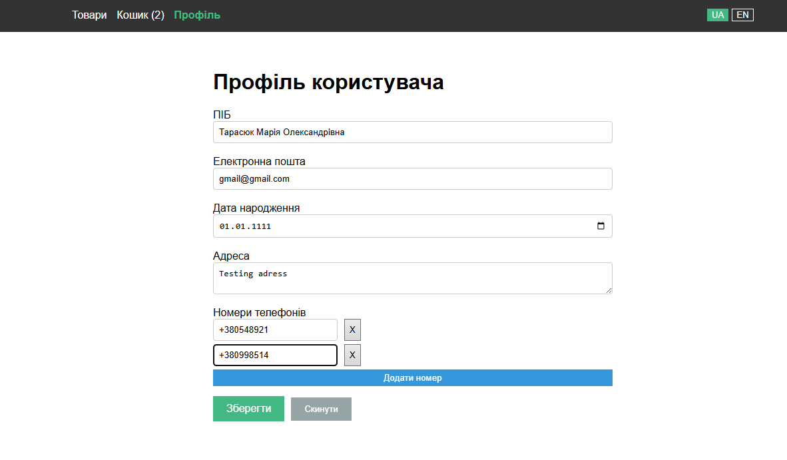
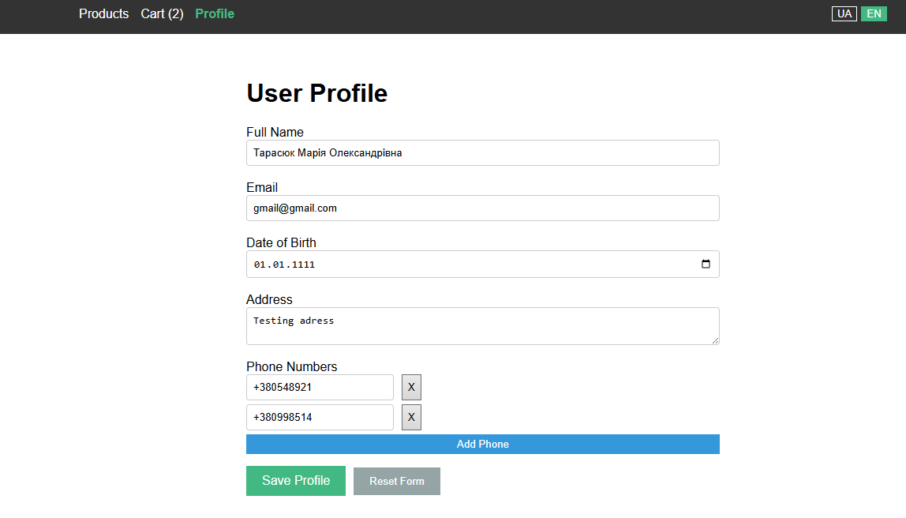
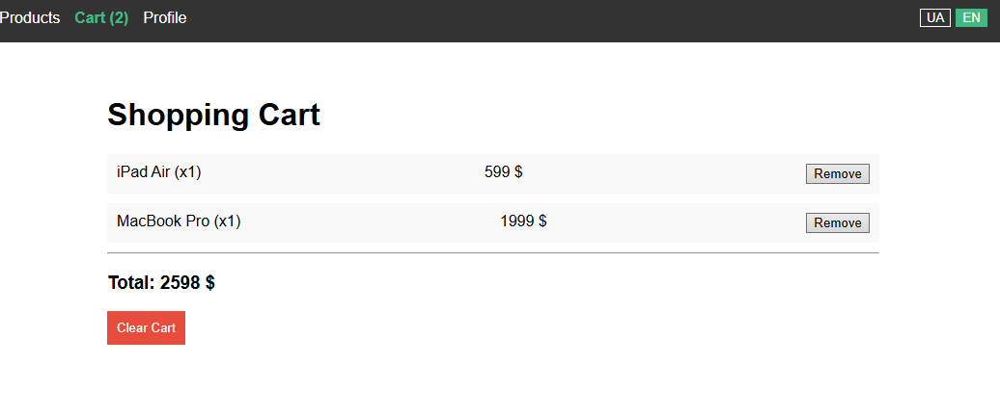

# Лабораторна робота №4: Управління станом (Pinia), локалізація (i18n) та валідація (VeeValidate)

## Опис

У цій роботі розроблено SPA-застосунок "Profile & Cart". Реалізовано централізоване сховище даних через **Pinia**, мультимовність інтерфейсу через **vue-i18n** та складну форму профілю з динамічними полями та валідацією через **VeeValidate** + **Yup**.

## Інструкція із запуску

1. **Встановлення залежностей:**
   ```bash
   npm install
   ```

---

2. **Запуск локального сервера:**
   ```bash
   npm run dev
   ```

---

## Скріншоти

1. **Профіль (Українська локалізація + Валідація)**

   

2. **Профіль (Англійська локалізація)**

   

3. **Кошик товарів**

   

## Технічні деталі

1. **Pinia**
   Використано для глобального керування станом застосунку.

- Ініціалізація: createPinia() підключено в main.ts.
- Стори (src/stores/):
  - products: Містить список доступних товарів (mock data).
  - cart: Реалізує логіку додавання/видалення товарів та обчислення суми (totalPrice, totalCount) через геттери.
  - settings: Відповідає за налаштування мови.
- Персистентність:
  - Використано плагін pinia-plugin-persistedstate.
  - У сторі settings налаштовано збереження тільки поля locale (pick: ['locale']) із власним ключем key: 'lab4-settings-store'. Це дозволяє зберігати обрану мову після перезавантаження сторінки.

2. **Vue-i18n**

- Конфігурація: Файл src/i18n.ts ініціалізує createI18n.
- Переклади: JSON-файли в src/locales/ (en, ua).
- Синхронізація: У сторі settings при виклику setLocale змінюється як стан Pinia, так і i18n.global.locale.value.
- Кастомний модифікатор: Реалізовано модифікатор snake, який перетворює текст у верхній регістр із підкресленнями (приклад використання на сторінці Products: nav.products.snake).

3. **VeeValidate + Yup**
   Реалізовано на сторінці ProfileView.vue.

- Схема валідації: Використано бібліотеку Yup. Схема створена через computed, щоб повідомлення помилок реактивно змінювались при перемиканні мови.
- useForm / useField: Використано для керування станом форми та окремих полів (ім'я, email, дата, адреса).
- useFieldArray: Реалізовано для динамічного списку телефонів (можливість додавати/видаляти номери).
- setFieldError: Емуляція помилки серверу. Якщо ввести email error@test.com, система встановить ручну помилку для поля email.
