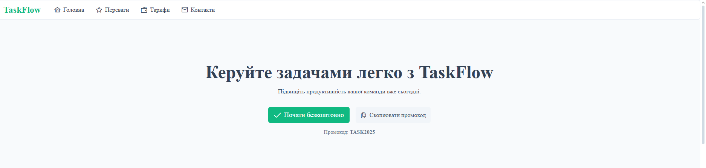
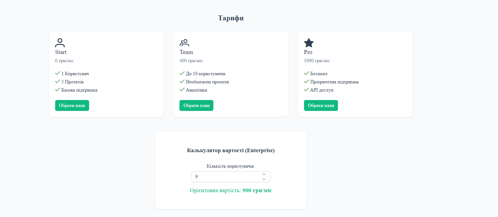
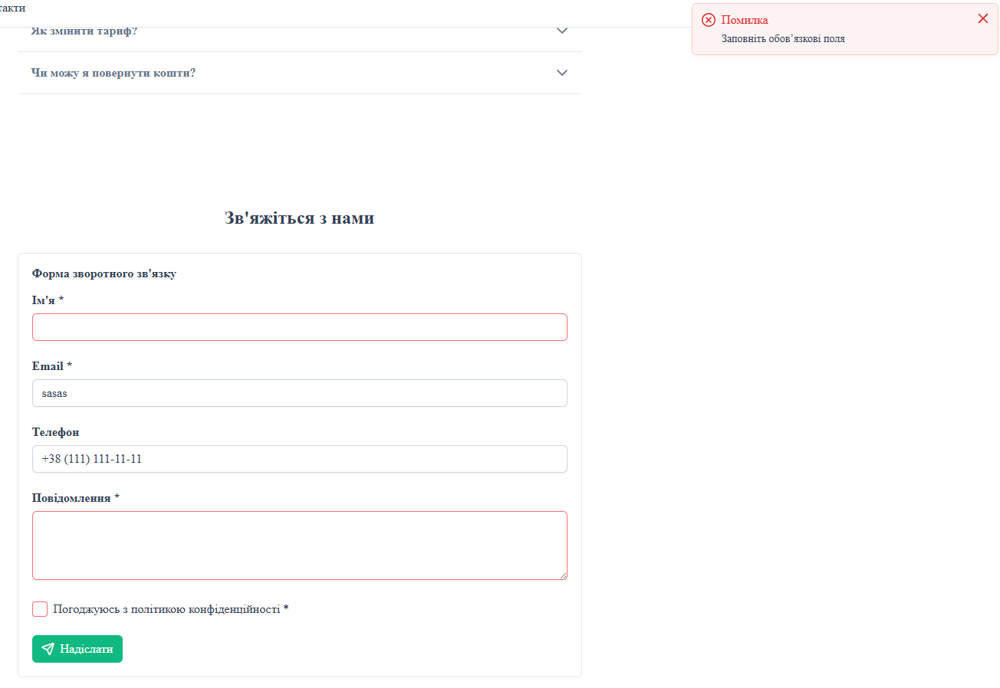
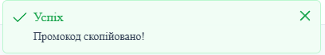
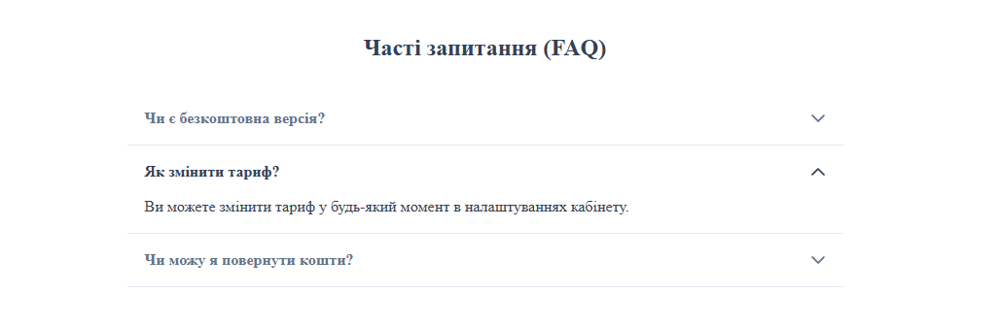

# Лабораторна робота №5: Інтерфейсні бібліотеки (PrimeVue) та Плагіни у Vue.js

## Опис

Розроблено односторінковий лендінг для SaaS-продукту "TaskFlow" (менеджер задач). У проекті використано бібліотеку компонентів **PrimeVue**, налаштовано тему Aura та реалізовано власний плагін для роботи з буфером обміну.

## Інструкція із запуску

1. **Встановлення залежностей:**
   ```bash
   npm install
   ```

---

2. **Запуск локального сервера:**
   ```bash
   npm run dev
   ```

---

## Скріншоти

1. Hero-секція та Меню

   

2. Тарифи з калькулятором

   

3. Контактна форма з валідацією

   

4. Робота плагіна (Toast повідомлення)

   

5. Часті запитання(FAQ)

   

---

## Технічні деталі

1. **Налаштування PrimeVue**
   Бібліотеку підключено в main.ts з використанням сучасної системи тем:

- Тема: Aura (@primeuix/themes/aura).
- Сервіси: Підключено ToastService для глобальних сповіщень.
- Іконки: Використано пакет primeicons.

2. **Використані компоненти PrimeVue**
   У проекті використано такі компоненти:

- Menubar: Навігація в хедері (AppHeader.vue).
- Button: Кнопки заклику до дії та копіювання в усіх секціях.
- Card: Картки для переваг та тарифних планів (FeaturesSection, PricingSection).
- Fieldset: Блок "Проблема - Рішення" з можливістю згортання.
- InputNumber: Поле для введення кількості користувачів у калькуляторі.
- Accordion: Секція частих запитань (FAQ).
- Panel, InputText, Textarea: Структура контактної форми.
- InputMask: Поле телефону з маскою +38 (999) ....
- Checkbox: Згода з політикою конфіденційності.
- Toast: Спливаючі повідомлення про успішні дії (копіювання, відправка форми).

3. **Власний плагін: CopyToClipboard**
   Реалізовано плагін src/plugins/copyToClipboard.ts, який додає функцію копіювання тексту в глобальний контекст.

   **Використання в проекті:**
   1. Hero Section: Кнопка "Скопійовати промокод". Копіює код TASK2025 та показує повідомлення про успіх.
   2. Contact Section: Кнопка для копіювання email-адреси підтримки у футері секції.

   **Реалізація:** Плагін використовує navigator.clipboard.writeText і повертає true/false, що дозволяє компонентам реагувати на результат (показувати Toast).

4. **Структура Лендінгу**
   Сайт складається з наступних логічних блоків:
   1. Header: Логотип та навігація.
   2. Hero: Заголовок, опис, кнопки CTA та промокод.
   3. Features: Блок "Проблема/Рішення" та картки переваг.
   4. Pricing: Тарифні плани та реактивний калькулятор вартості.
   5. FAQ: Акордеон із відповідями на запитання.
   6. Contact: Форма з валідацією полів та маскою телефону.
   7. Footer: Копірайт.
